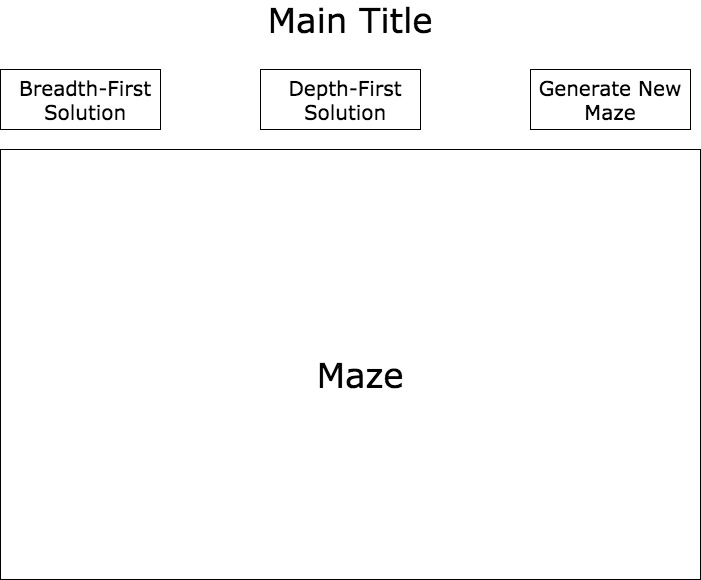

## MazeCraze

### Background

MazeCraze is a maze solving game that doubles as an algorithm visualization tool.

### Functionality & MVP  

With MazeCraze, users will be able to:

- [ ] Generate a random maze
- [ ] Click squares to attempt to solve the maze
- [ ] Click "Breadth-First Search Solution" or "Depth-First Search Solution" to visualize how the maze is solved using these algorithms

In addition, this project will include:

- [ ] A production Readme

### Wireframes

This app will consist of a single screen with the maze, directions at the bottom (clicking squares), buttons to solve the current maze using a breadth-first or depth-first search algorithm, a button to generate a new maze, and nav links to GitHub and LinkedIn.

### Architecture and Technologies

This project will be implemented with the following technologies:

- Vanilla JavaScript and `jquery` for overall structure and game logic,
- `Easel.js` with `HTML5 Canvas` for DOM manipulation and rendering,
- Webpack to bundle and serve up the various scripts.

In addition to the webpack entry file, there will be three scripts involved in this project:

`maze.js`: this script will handle the logic for creating and updating the necessary `Easel.js` elements and rendering them to the DOM.

`breadth_first.js`: this script will handle the logic for solving the current maze via a breadth-first search.

`depth_first.js`: this script will handle the logic for solving the current maze via a depth-first search.

`generate_new_maze.js`: this script will house the random maze generation algorithm.

### Implementation Timeline

**Day 1**: Setup necessary modules, including getting webpack up and running and `Easel.js` installed.  Create `webpack.config.js` as well as `package.json`.  Write a basic entry file and the bare bones of all 3 scripts outlined above.  Learn the basics of `Easel.js`.  Goals for the day:

- Get a green bundle with `webpack`
- Learn enough `Easel.js` to render an object to the `Canvas` element

**Day 2**: Learn the `Easel.js` API.  Use `maze.js` to render maze that will be generated with `generate_new_maze.js`. Goals for the day:

- Write random maze generator algorithm in `generate_new_maze.js`
- Render maze to the `Canvas` using `Easel.js`
- Make each square in the maze clickable, toggling the state of the square on click
- Add clickable button to generate new maze

**Day 3**: Write logic for breadth-first and depth-first search algorithms. Goals for the day:

- Write breadth-first search solution in `breadth_first.js`
- Write depth-first search solution in `depth_first.js`
- Add buttons to trigger the breadth-first search or depth-first search solution

**Day 4**: Style the frontend, making it polished and professional.  Goals for the day:

- Have a styled `Canvas`, nice looking controls and title

### Bonus features

Some anticipated updates are:

- [ ] Add more tree search visualization options
- [ ] Make maze 3D
